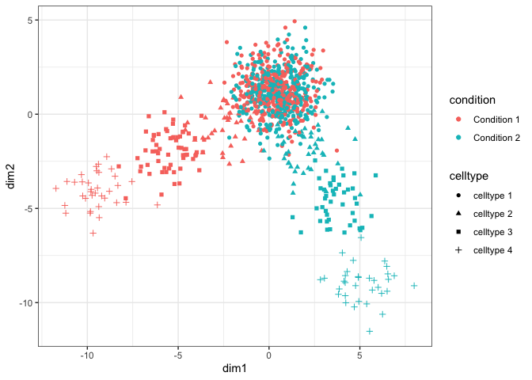
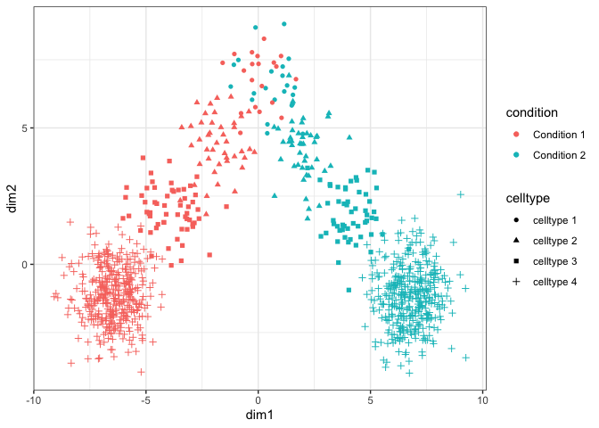

``` r
#load required libraries
library(splatter)
```

    ## Loading required package: SingleCellExperiment

    ## Loading required package: SummarizedExperiment

    ## Loading required package: GenomicRanges

    ## Loading required package: stats4

    ## Loading required package: BiocGenerics

    ## Loading required package: parallel

    ## 
    ## Attaching package: 'BiocGenerics'

    ## The following objects are masked from 'package:parallel':
    ## 
    ##     clusterApply, clusterApplyLB, clusterCall, clusterEvalQ,
    ##     clusterExport, clusterMap, parApply, parCapply, parLapply,
    ##     parLapplyLB, parRapply, parSapply, parSapplyLB

    ## The following objects are masked from 'package:stats':
    ## 
    ##     IQR, mad, sd, var, xtabs

    ## The following objects are masked from 'package:base':
    ## 
    ##     anyDuplicated, append, as.data.frame, basename, cbind,
    ##     colnames, dirname, do.call, duplicated, eval, evalq, Filter,
    ##     Find, get, grep, grepl, intersect, is.unsorted, lapply, Map,
    ##     mapply, match, mget, order, paste, pmax, pmax.int, pmin,
    ##     pmin.int, Position, rank, rbind, Reduce, rownames, sapply,
    ##     setdiff, sort, table, tapply, union, unique, unsplit, which,
    ##     which.max, which.min

    ## Loading required package: S4Vectors

    ## 
    ## Attaching package: 'S4Vectors'

    ## The following object is masked from 'package:base':
    ## 
    ##     expand.grid

    ## Loading required package: IRanges

    ## Loading required package: GenomeInfoDb

    ## Loading required package: Biobase

    ## Welcome to Bioconductor
    ## 
    ##     Vignettes contain introductory material; view with
    ##     'browseVignettes()'. To cite Bioconductor, see
    ##     'citation("Biobase")', and for packages 'citation("pkgname")'.

    ## Loading required package: DelayedArray

    ## Loading required package: matrixStats

    ## 
    ## Attaching package: 'matrixStats'

    ## The following objects are masked from 'package:Biobase':
    ## 
    ##     anyMissing, rowMedians

    ## Loading required package: BiocParallel

    ## 
    ## Attaching package: 'DelayedArray'

    ## The following objects are masked from 'package:matrixStats':
    ## 
    ##     colMaxs, colMins, colRanges, rowMaxs, rowMins, rowRanges

    ## The following objects are masked from 'package:base':
    ## 
    ##     aperm, apply, rowsum

``` r
library(scater)
```

    ## Loading required package: ggplot2

    ## 
    ## Attaching package: 'scater'

    ## The following object is masked from 'package:S4Vectors':
    ## 
    ##     rename

    ## The following object is masked from 'package:stats':
    ## 
    ##     filter

``` r
#Enter destination path here
PATH = "~/Single Cell/forKun"

#helper function to assign cells to patients in a probablistic fashion 
assign_patients <- function(tpm, batch, celltype, fracs, n = 50){
  patient = rep(NA, length(batch))
  id = 0
  for(b in seq(length(unique(batch)))){
  for(i in seq(id + 1, id + round(length(batch)/(length(unique(batch))*length(unique(celltype))*n)))){
    print(i)
    ncells <- as.numeric(t(rmultinom(1, size = n, prob = fracs)))
    for(j in seq(length(fracs))){
      idx = which(is.na(patient))
      k = sample(which(batch[idx] == paste("Condition ",b,sep = "") & celltype[idx] == paste("celltype ",j, sep = "")), ncells[j])
      patient[idx][k] = paste("patient",i,sep = "")
    }
    id = i
  }
    
  }
  
  return(patient)
  
}

#helper function to generate ground truth datasets for deconvolution
generate_gt <- function(dataset,id, path){
cctypes = unique(dataset$celltype)
#obtain patient specific cell fractions
sim_cell_fracs <- sapply(unique(dataset$patients), function(x) {
  idx = which(dataset$patients == x)
  counts = sapply(cctypes, function(y) {
    return(sum(dataset$patients == x & dataset$celltype == y))
  })
  counts = counts/sum(counts)
  names(counts) = cctypes
  return(counts)
})

#obtain patient specific mean expression in each cell type
sim_ct_expr <- lapply(unique(dataset$patients), function(x) {
  cdat <- sapply(cctypes, function(y) {
    if(sum(dataset$patients == x & dataset$celltype == y) > 1){
    return(rowMeans(dataset$tpm[,dataset$patients == x & dataset$celltype == y],na.rm = T))
    }
    else if(sum(dataset$patients == x & dataset$celltype == y) == 1){
      return(dataset$tpm[,dataset$patients == x & dataset$celltype == y])
    }
    else{
      return(rep(0, nrow(dataset$tpm)))
    }
  })
  return(cdat)
})
names(sim_ct_expr) <- unique(dataset$patients)

sim_ct_expr2 <- lapply(cctypes, function(x){
  return(sapply(unique(dataset$patients), function(y){
    return(sim_ct_expr[[y]][,x])
  }))
})
names(sim_ct_expr2) = cctypes

#generate expected bulk expression profiles for each patient based on the single cell expression profile of each cell type in that patient
sim_bulk <- sapply(unique(dataset$patients), function(x) {
  bb <-sim_ct_expr[[x]]%*%sim_cell_fracs[,x]
})
rownames(sim_bulk) = rownames(dataset$tpm)
sim_cell_fracs <- t(sim_cell_fracs)

sim_meta <- data.frame(Cell = colnames(dataset$tpm), celltype = dataset$celltype, patient = dataset$patients, batch = dataset$batch)

saveRDS(dataset$tpm,file = paste(path,"/Sim_singleCell_TPM_",id,".rds",sep = ""))

#cell fraction estimates for cell types
saveRDS(sim_cell_fracs, file = paste(path, "/sim_cellfracs_",id,".rds",sep = ""))

#cell type specific expression in each patient: ground truth for deconvolution validation
saveRDS(sim_ct_expr2, file = paste(path, "/sim_groundtruth_tpm_",id,".rds",sep = ""))

#Livnat dataset updated cell --> cell type --> patient mapping
saveRDS(sim_meta, file = paste(path, "/sim_celltypes_table_",id,".rds",sep = ""))


#in-silico bulk gene expression for each of the 200 patients
saveRDS(sim_bulk, file = paste(path, "/sim_bulk_tpm_",id,".rds",sep = ""))
}

#cell types: (Celltype 1, Celltype 2, Celltype 3, Celltype 4)
#conditions: (A,B)
#Celltype 1 is least differentially expressed between conditions
#Celltype 4 is most differentially expressed between conditions

#Simulation dataset 1: Cell type 1 is most abundant cell type in the population of patients and celltype 4 is least abundant
#Simulation dataset 2: Cell type 4 is most abundant cell type in the population of patients and celltype 1 is least abundant

N <- 4
M <- 2
nCells <- 2500
effect_size <- c(0.001,0.03,0.06,0.1)
params = list()
c <- list()
tpms <- list()
ctype <- c()
condition <- c()

for(i in seq(N)){
  cond <- sapply(seq(M), function(x) paste("Condition ",x,sep = ""))
  params[[i]] <- newSplatParams()
  params[[i]] <- setParams(params[[i]], update = list(mean.rate = 0.5, mean.shape = 0.5))
  c[[i]] <- splatSimulate(params[[i]], batchCells = rep(nCells,M),
                      batch.facLoc = effect_size[i], batch.facScale = effect_size[i],
                      verbose = FALSE)
  
  tpm(c[[i]]) <- calculateTPM(c[[i]], rowData(c[[1]])$Length)
  tpms[[i]] <- tpm(c[[i]])
  ctype <- c(ctype, rep(paste("celltype ",i,sep = ""), ncol(tpms[[i]])))
  condition <- c(condition, cond[as.numeric(sapply(as.character(c[[i]]$Batch), function(x) gsub("Batch","",x)))])
}
dat <- Reduce(cbind, tpms)


#Simulation dataset1: 
patients <- assign_patients(dat, condition, ctype, c(0.75,0.1,0.1,0.05))
```

    ## [1] 1
    ## [1] 2
    ## [1] 3
    ## [1] 4
    ## [1] 5
    ## [1] 6
    ## [1] 7
    ## [1] 8
    ## [1] 9
    ## [1] 10
    ## [1] 11
    ## [1] 12
    ## [1] 13
    ## [1] 14
    ## [1] 15
    ## [1] 16
    ## [1] 17
    ## [1] 18
    ## [1] 19
    ## [1] 20
    ## [1] 21
    ## [1] 22
    ## [1] 23
    ## [1] 24
    ## [1] 25
    ## [1] 26
    ## [1] 27
    ## [1] 28
    ## [1] 29
    ## [1] 30
    ## [1] 31
    ## [1] 32
    ## [1] 33
    ## [1] 34
    ## [1] 35
    ## [1] 36
    ## [1] 37
    ## [1] 38
    ## [1] 39
    ## [1] 40
    ## [1] 41
    ## [1] 42
    ## [1] 43
    ## [1] 44
    ## [1] 45
    ## [1] 46
    ## [1] 47
    ## [1] 48
    ## [1] 49
    ## [1] 50
    ## [1] 51
    ## [1] 52
    ## [1] 53
    ## [1] 54
    ## [1] 55
    ## [1] 56
    ## [1] 57
    ## [1] 58
    ## [1] 59
    ## [1] 60
    ## [1] 61
    ## [1] 62
    ## [1] 63
    ## [1] 64
    ## [1] 65
    ## [1] 66
    ## [1] 67
    ## [1] 68
    ## [1] 69
    ## [1] 70
    ## [1] 71
    ## [1] 72
    ## [1] 73
    ## [1] 74
    ## [1] 75
    ## [1] 76
    ## [1] 77
    ## [1] 78
    ## [1] 79
    ## [1] 80
    ## [1] 81
    ## [1] 82
    ## [1] 83
    ## [1] 84
    ## [1] 85
    ## [1] 86
    ## [1] 87
    ## [1] 88
    ## [1] 89
    ## [1] 90
    ## [1] 91
    ## [1] 92
    ## [1] 93
    ## [1] 94
    ## [1] 95
    ## [1] 96
    ## [1] 97
    ## [1] 98
    ## [1] 99
    ## [1] 100

``` r
dataset1 <- list()
dataset1$tpm <- dat[,!is.na(patients)]
dataset1$patients <- patients[!is.na(patients)]
dataset1$celltype <- as.character(ctype)
dataset1$celltype = dataset1$celltype[!is.na(patients)]
dataset1$batch = as.character(condition)
dataset1$batch = dataset1$batch[!is.na(patients)]


idx <- sample(ncol(dataset1$tpm),1000)
res <- prcomp(t(dataset1$tpm[rowSums(dataset1$tpm[,idx]) != 0, idx]),scale = T)
print(dim(res$x))
```

    ## [1] 1000 1000

``` r
p1 <- ggplot(data = data.frame(dim1 = res$x[,1],dim2 = res$x[,2], condition = dataset1$batch[idx], celltype = dataset1$celltype[idx]), aes(x= dim1, y = dim2, color = condition, shape = celltype)) + geom_point() + theme_bw()
print(p1)
```



``` r
#ggsave(p1, filename = paste(PATH,"/sim_dataset1_pca.pdf",sep = ""), useDingbats = F)
generate_gt(dataset1,1, PATH)
rm(dataset1)


#Simulation dataset2: 
patients <- assign_patients(dat, condition, ctype, c(0.05,0.1,0.1,0.75))
```

    ## [1] 1
    ## [1] 2
    ## [1] 3
    ## [1] 4
    ## [1] 5
    ## [1] 6
    ## [1] 7
    ## [1] 8
    ## [1] 9
    ## [1] 10
    ## [1] 11
    ## [1] 12
    ## [1] 13
    ## [1] 14
    ## [1] 15
    ## [1] 16
    ## [1] 17
    ## [1] 18
    ## [1] 19
    ## [1] 20
    ## [1] 21
    ## [1] 22
    ## [1] 23
    ## [1] 24
    ## [1] 25
    ## [1] 26
    ## [1] 27
    ## [1] 28
    ## [1] 29
    ## [1] 30
    ## [1] 31
    ## [1] 32
    ## [1] 33
    ## [1] 34
    ## [1] 35
    ## [1] 36
    ## [1] 37
    ## [1] 38
    ## [1] 39
    ## [1] 40
    ## [1] 41
    ## [1] 42
    ## [1] 43
    ## [1] 44
    ## [1] 45
    ## [1] 46
    ## [1] 47
    ## [1] 48
    ## [1] 49
    ## [1] 50
    ## [1] 51
    ## [1] 52
    ## [1] 53
    ## [1] 54
    ## [1] 55
    ## [1] 56
    ## [1] 57
    ## [1] 58
    ## [1] 59
    ## [1] 60
    ## [1] 61
    ## [1] 62
    ## [1] 63
    ## [1] 64
    ## [1] 65
    ## [1] 66
    ## [1] 67
    ## [1] 68
    ## [1] 69
    ## [1] 70
    ## [1] 71
    ## [1] 72
    ## [1] 73
    ## [1] 74
    ## [1] 75
    ## [1] 76
    ## [1] 77
    ## [1] 78
    ## [1] 79
    ## [1] 80
    ## [1] 81
    ## [1] 82
    ## [1] 83
    ## [1] 84
    ## [1] 85
    ## [1] 86
    ## [1] 87
    ## [1] 88
    ## [1] 89
    ## [1] 90
    ## [1] 91
    ## [1] 92
    ## [1] 93
    ## [1] 94
    ## [1] 95
    ## [1] 96
    ## [1] 97
    ## [1] 98
    ## [1] 99
    ## [1] 100

``` r
dataset2 <- list()
dataset2$tpm <- dat[,!is.na(patients)]
dataset2$patients <- patients[!is.na(patients)]
dataset2$celltype <- as.character(ctype)
dataset2$celltype = dataset2$celltype[!is.na(patients)]
dataset2$batch = as.character(condition)
dataset2$batch = dataset2$batch[!is.na(patients)]
rm(dat)


idx <- sample(ncol(dataset2$tpm),1000)
res <- prcomp(t(dataset2$tpm[rowSums(dataset2$tpm[,idx]) != 0, idx]),scale = T)
print(dim(res$x))
```

    ## [1] 1000 1000

``` r
p2 <- ggplot(data = data.frame(dim1 = res$x[,1],dim2 = res$x[,2], condition = dataset2$batch[idx], celltype = dataset2$celltype[idx]), aes(x= dim1, y = dim2, color = condition, shape = celltype)) + geom_point() + theme_bw()
print(p2)
```



``` r
#ggsave(p2, filename = paste(PATH,"/sim_dataset2_pca.pdf",sep = ""), useDingbats = F)
generate_gt(dataset2,2, PATH)
rm(dataset2)

rm(tpms)
rm(res)
rm(c)

####################################################################################################################################
#cell types: (Celltype 1, Celltype 2, Celltype 3, Celltype 4)
#conditions: (1,2,3)
#Celltype 1 is least differentially expressed between conditions
#Celltype 4 is most differentially expressed between conditions

#Simulation dataset 3: Cell type 1 is most abundant cell type in the population of patients and celltype 4 is least abundant
#Simulation dataset 4: Cell type 4 is most abundant cell type in the population of patients and celltype 1 is least abundant
N <- 4
M <- 3
nCells <- 1700
effect_size <- c(0.001,0.03,0.05,0.1)
params = list()
c <- list()
tpms <- list()
ctype <- c()
condition <- c()
for(i in seq(N)){
  cond <- sapply(seq(M), function(x) paste("Condition ",x,sep = ""))
  params[[i]] <- newSplatParams()
  params[[i]] <- setParams(params[[i]], update = list(mean.rate = 0.5, mean.shape = 0.5))
  c[[i]] <- splatSimulate(params[[i]], batchCells = rep(nCells,M),
                      batch.facLoc = effect_size[i], batch.facScale = effect_size[i],
                      verbose = FALSE)
  
  tpm(c[[i]]) <- calculateTPM(c[[i]], rowData(c[[1]])$Length)
  tpms[[i]] <- tpm(c[[i]])
  ctype <- c(ctype, rep(paste("celltype ",i,sep = ""), ncol(tpms[[i]])))
  condition <- c(condition, cond[as.numeric(sapply(as.character(c[[i]]$Batch), function(x) gsub("Batch","",x)))])
}
dat <- Reduce(cbind, tpms)


#Simulation dataset3: 
patients <- assign_patients(dat, condition, ctype, c(0.75,0.1,0.1,0.05))
```

    ## [1] 1
    ## [1] 2
    ## [1] 3
    ## [1] 4
    ## [1] 5
    ## [1] 6
    ## [1] 7
    ## [1] 8
    ## [1] 9
    ## [1] 10
    ## [1] 11
    ## [1] 12
    ## [1] 13
    ## [1] 14
    ## [1] 15
    ## [1] 16
    ## [1] 17
    ## [1] 18
    ## [1] 19
    ## [1] 20
    ## [1] 21
    ## [1] 22
    ## [1] 23
    ## [1] 24
    ## [1] 25
    ## [1] 26
    ## [1] 27
    ## [1] 28
    ## [1] 29
    ## [1] 30
    ## [1] 31
    ## [1] 32
    ## [1] 33
    ## [1] 34
    ## [1] 35
    ## [1] 36
    ## [1] 37
    ## [1] 38
    ## [1] 39
    ## [1] 40
    ## [1] 41
    ## [1] 42
    ## [1] 43
    ## [1] 44
    ## [1] 45
    ## [1] 46
    ## [1] 47
    ## [1] 48
    ## [1] 49
    ## [1] 50
    ## [1] 51
    ## [1] 52
    ## [1] 53
    ## [1] 54
    ## [1] 55
    ## [1] 56
    ## [1] 57
    ## [1] 58
    ## [1] 59
    ## [1] 60
    ## [1] 61
    ## [1] 62
    ## [1] 63
    ## [1] 64
    ## [1] 65
    ## [1] 66
    ## [1] 67
    ## [1] 68
    ## [1] 69
    ## [1] 70
    ## [1] 71
    ## [1] 72
    ## [1] 73
    ## [1] 74
    ## [1] 75
    ## [1] 76
    ## [1] 77
    ## [1] 78
    ## [1] 79
    ## [1] 80
    ## [1] 81
    ## [1] 82
    ## [1] 83
    ## [1] 84
    ## [1] 85
    ## [1] 86
    ## [1] 87
    ## [1] 88
    ## [1] 89
    ## [1] 90
    ## [1] 91
    ## [1] 92
    ## [1] 93
    ## [1] 94
    ## [1] 95
    ## [1] 96
    ## [1] 97
    ## [1] 98
    ## [1] 99
    ## [1] 100
    ## [1] 101
    ## [1] 102

``` r
dataset3 <- list()
dataset3$tpm <- dat[,!is.na(patients)]
dataset3$patients <- patients[!is.na(patients)]
dataset3$celltype <- as.character(ctype)
dataset3$celltype = dataset3$celltype[!is.na(patients)]
dataset3$batch = as.character(condition)
dataset3$batch = dataset3$batch[!is.na(patients)]


idx <- sample(ncol(dataset3$tpm),1000)
res <- prcomp(t(dataset3$tpm[rowSums(dataset3$tpm[,idx]) != 0, idx]),scale = T)
print(dim(res$x))
```

    ## [1] 1000 1000

``` r
p3 <- ggplot(data = data.frame(dim1 = res$x[,1],dim2 = res$x[,2], condition = dataset3$batch[idx], celltype = dataset3$celltype[idx]), aes(x= dim1, y = dim2, color = condition, shape = celltype)) + geom_point() + theme_bw()
print(p3)
```


``` r
#ggsave(p3, filename = paste(PATH, "/sim_dataset3_pca.pdf", sep = ""), useDingbats = F)
generate_gt(dataset3,3, PATH)
rm(dataset3)


#Simulation dataset4: 
patients <- assign_patients(dat, condition, ctype, c(0.05,0.1,0.1,0.75))
```

    ## [1] 1
    ## [1] 2
    ## [1] 3
    ## [1] 4
    ## [1] 5
    ## [1] 6
    ## [1] 7
    ## [1] 8
    ## [1] 9
    ## [1] 10
    ## [1] 11
    ## [1] 12
    ## [1] 13
    ## [1] 14
    ## [1] 15
    ## [1] 16
    ## [1] 17
    ## [1] 18
    ## [1] 19
    ## [1] 20
    ## [1] 21
    ## [1] 22
    ## [1] 23
    ## [1] 24
    ## [1] 25
    ## [1] 26
    ## [1] 27
    ## [1] 28
    ## [1] 29
    ## [1] 30
    ## [1] 31
    ## [1] 32
    ## [1] 33
    ## [1] 34
    ## [1] 35
    ## [1] 36
    ## [1] 37
    ## [1] 38
    ## [1] 39
    ## [1] 40
    ## [1] 41
    ## [1] 42
    ## [1] 43
    ## [1] 44
    ## [1] 45
    ## [1] 46
    ## [1] 47
    ## [1] 48
    ## [1] 49
    ## [1] 50
    ## [1] 51
    ## [1] 52
    ## [1] 53
    ## [1] 54
    ## [1] 55
    ## [1] 56
    ## [1] 57
    ## [1] 58
    ## [1] 59
    ## [1] 60
    ## [1] 61
    ## [1] 62
    ## [1] 63
    ## [1] 64
    ## [1] 65
    ## [1] 66
    ## [1] 67
    ## [1] 68
    ## [1] 69
    ## [1] 70
    ## [1] 71
    ## [1] 72
    ## [1] 73
    ## [1] 74
    ## [1] 75
    ## [1] 76
    ## [1] 77
    ## [1] 78
    ## [1] 79
    ## [1] 80
    ## [1] 81
    ## [1] 82
    ## [1] 83
    ## [1] 84
    ## [1] 85
    ## [1] 86
    ## [1] 87
    ## [1] 88
    ## [1] 89
    ## [1] 90
    ## [1] 91
    ## [1] 92
    ## [1] 93
    ## [1] 94
    ## [1] 95
    ## [1] 96
    ## [1] 97
    ## [1] 98
    ## [1] 99
    ## [1] 100
    ## [1] 101
    ## [1] 102

``` r
dataset4 <- list()
dataset4$tpm <- dat[,!is.na(patients)]
dataset4$patients <- patients[!is.na(patients)]
dataset4$celltype <- as.character(ctype)
dataset4$celltype = dataset4$celltype[!is.na(patients)]
dataset4$batch = as.character(condition)
dataset4$batch = dataset4$batch[!is.na(patients)]
rm(dat)


idx <- sample(ncol(dataset4$tpm),1000)
res <- prcomp(t(dataset4$tpm[rowSums(dataset4$tpm[,idx]) != 0, idx]),scale = T)
print(dim(res$x))
```

    ## [1] 1000 1000

``` r
p4 <- ggplot(data = data.frame(dim1 = res$x[,1],dim2 = res$x[,2], condition = dataset4$batch[idx], celltype = dataset4$celltype[idx]), aes(x= dim1, y = dim2, color = condition, shape = celltype)) + geom_point() + theme_bw()
print(p4)
```


``` r
#ggsave(p4, filename = paste(PATH, "/sim_dataset4_pca.pdf", sep = ""), useDingbats = F)
generate_gt(dataset4,4, PATH)
rm(dataset4)
```
